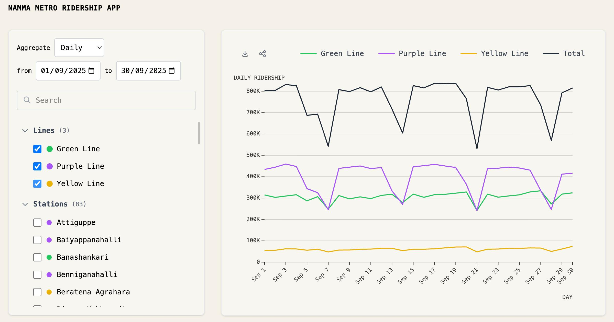

# TransitRidership

Explore, filter and visualize transit ridership trends by line and station: https://ridership.bengawalk.com

## Features

- Interactive charts of ridership trends over time
- Filter by date range, day of week, and hour
- Select any line or station in the network
- Calculate aggregate statistics for the filtered selection
- Export CSV of filtered selection data
- Share link for filtered selection chart

## Develop

- Install dependencies with `pnpm install` (or `npm install`)
- Prepare JSON files for the web app with `pnpm run generate-data` (or `npm run generate-data`)
- Start local dev server with `pnpm run start` (or `npm run start`)
- Build site deployment assets with `pnpm run build` (or `npm run build`)

## Data

TransitRidership uses optimized JSON files for displaying the data.

The data for the Namma Metro Ridership App is sourced from the [BMRCL Ridership Hourly](https://github.com/Vonter/bmrcl-ridership-hourly) repository. The original Parquet files are converted to optimized JSON files for the app using the `scripts/generate-data.py` script.

## License

[MIT](LICENSE)

## Credits

Inspired by [LA Metro Ridership App](https://ridership.streetsforall.org/) from the [Streets for All Data/Dev Team](https://streetsforall.org)

## AI Declaration

Components of this repository, including code and documentation, were written with assistance from Claude AI.